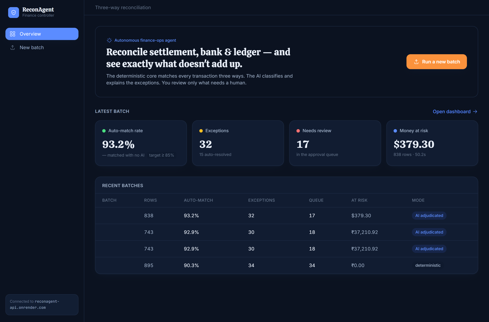
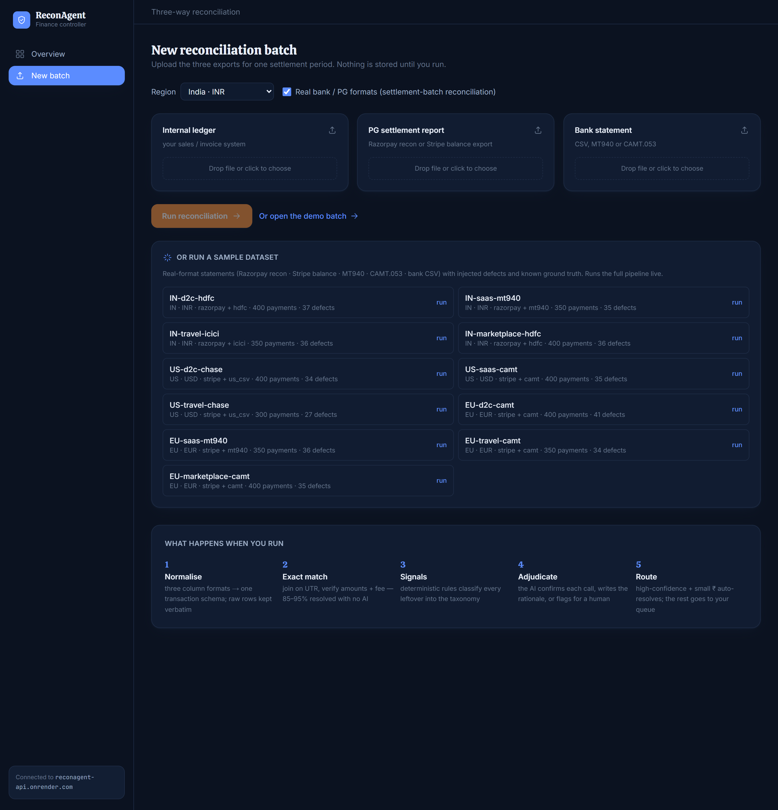
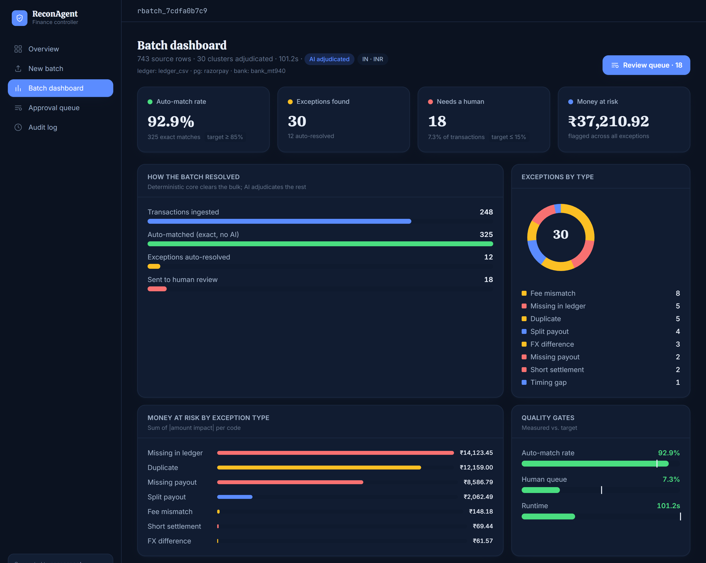
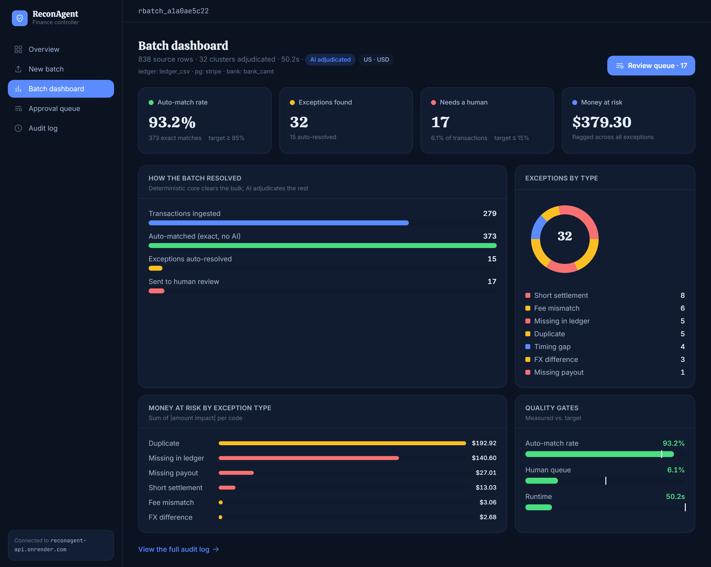
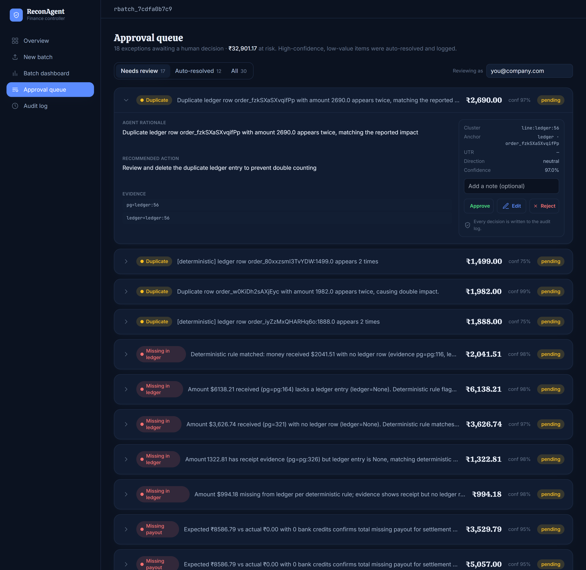
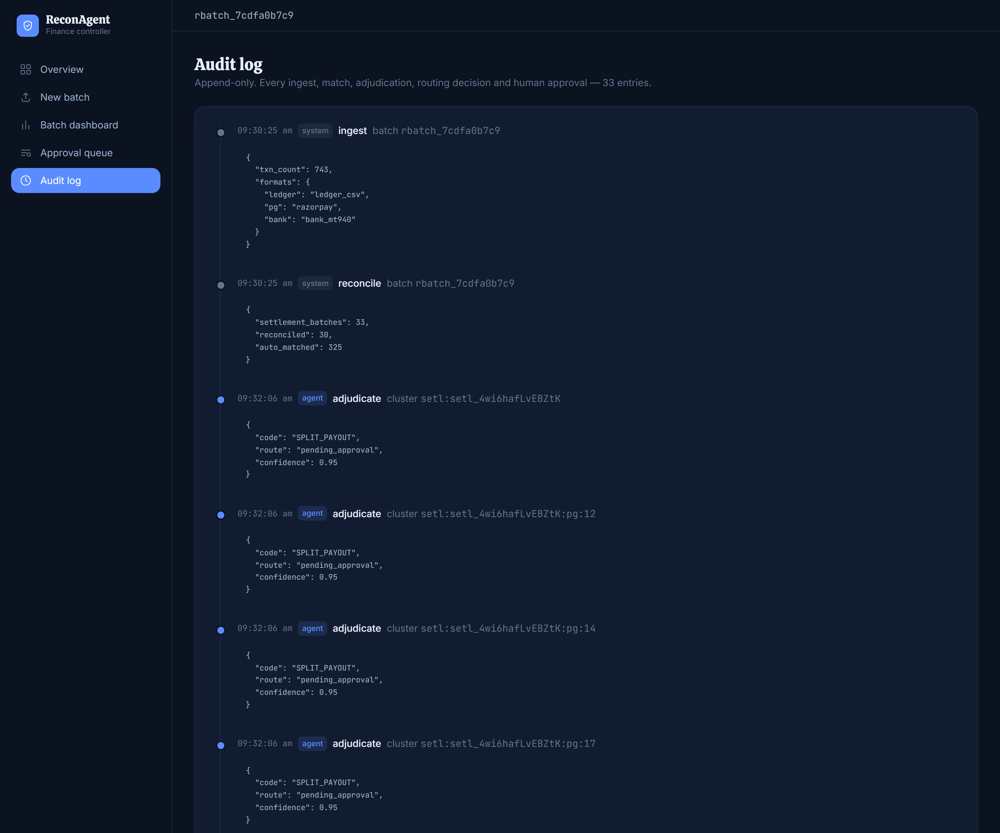
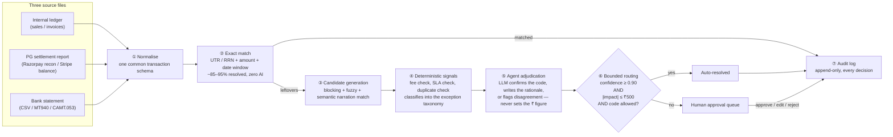
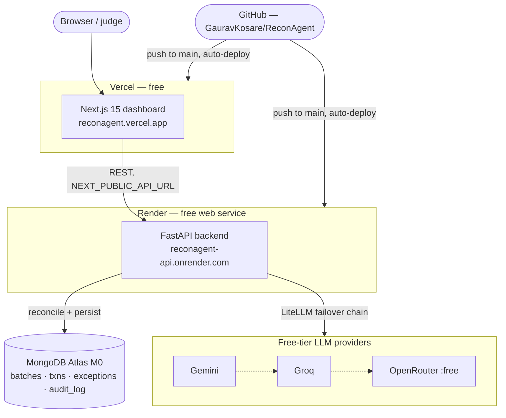

# ReconAgent

**Autonomous three-way reconciliation & settlement-exception agent.**

Built for the **Razorpay AI Buildathon — Track 04: AI Finance Controller**.

ReconAgent ingests a payment-gateway settlement report, a bank statement, and an
internal sales ledger, then closes the finance-ops loop automatically: it
three-way matches every transaction, classifies the mismatches it cannot match,
drafts a bounded resolution with a confidence score, and routes anything risky to
a human approval queue — while writing an immutable audit trail for every
decision.

> The computer does the math. The AI does the judgement. Neither one touches
> money without a human in the loop.

**🔗 Live demo:** [reconagent.vercel.app](https://reconagent.vercel.app) · **API:** [reconagent-api.onrender.com](https://reconagent-api.onrender.com/health) · **Repo:** [github.com/GauravKosare/ReconAgent](https://github.com/GauravKosare/ReconAgent)

> Both run on free tiers, so the very first request after a few idle minutes
> can take 30–60s to wake the backend up (Render's free-tier cold start). If
> the dashboard shows a **"Demo mode"** badge, that's the bundled sample batch
> rendering while the API wakes — reload after a few seconds, or go to
> **New batch → Run a sample dataset** to trigger and watch a real run.

---

## Screenshots

| Overview | New batch |
| --- | --- |
|  |  |

| Batch dashboard (India, ₹) | Batch dashboard (US, $) |
| --- | --- |
|  |  |

Same engine, two live runs, two currencies — money figures are formatted in
the batch's own currency throughout, not hardcoded to ₹.

| Approval queue | Audit log |
| --- | --- |
|  |  |

The queue screenshot is mid-review: one exception has already been approved
(queue count dropped from 18 → 17) — that decision is the last entry in the
audit log on the right, written by a real `POST /approvals` call against the
live backend, not a mocked interaction.

---

## Why this exists

Every business on a payment gateway has to reconcile three records that never
fully agree:

| Record | Says |
| --- | --- |
| Internal ledger | "I sold 100 items for ₹1,000." |
| PG settlement report | "Collected ₹1,000, kept ₹20 fee, refunded ₹15, paid you ₹965." |
| Bank statement | "₹965 credited today; ₹950 credited two days ago." |

Fees, taxes, refunds, chargebacks, `T+2` settlement timing and split payouts
produce hundreds-to-thousands of mismatches per month that finance teams chase by
hand in spreadsheets. ReconAgent automates the boring 90% and focuses a human on
the tricky 10% — with receipts.

---

## What it does

1. **Ingest & normalise** three heterogeneous files into one transaction schema.
2. **Exact match** on strong keys (UTR / RRN / payment_id + amount + date window).
   This resolves ~85–95% of volume with zero LLM calls.
3. **Candidate generation** for the leftovers (blocking + fuzzy + semantic
   narration similarity).
4. **Agent adjudication** — an LLM, behind a provider-agnostic interface,
   classifies each unresolved cluster into an exception taxonomy, verifies it
   with deterministic tools, and returns a structured verdict + confidence +
   plain-English rationale.
5. **Bounded routing** — high confidence + small rupee impact → auto-resolved
   (still logged); everything else → human approval queue.
6. **Audit & reporting** — append-only audit log; metrics report (auto-match
   rate, exception precision/recall vs. a ground-truth key, ₹ flagged, runtime).

### Workflow



---

## Tech stack

| Layer | Choice | Notes |
| --- | --- | --- |
| Agent brain | **Free-tier hosted LLMs** via [LiteLLM](https://github.com/BerriAI/litellm) | Groq (primary) → Gemini → OpenRouter `:free` models, automatic failover. No local model, no cost, no lock-in. |
| Agent framework | Custom bounded tool-loop + Pydantic-validated output | Full control over the audit trail; model is pluggable via `ModelClient`. |
| Backend | **FastAPI** (Python 3.12+) | One language with the matching core and the agent. |
| Deterministic matching | **Polars** + **RapidFuzz** + sentence-embeddings | Exact match, probabilistic linkage, semantic narration match. |
| Database | **MongoDB Atlas (M0 free)** | Heterogeneous raw records as documents; aggregation pipeline for reporting; Atlas Vector Search for narration matching. |
| Frontend | **Next.js 15** + Tailwind | Overview, batch dashboard, exception approval queue, audit timeline. Renders from bundled sample data when the API is offline (demo mode). |
| Queue (optional) | **Upstash Redis** (free) | Batch runs as tracked jobs for throughput metrics. |
| Hosting | **Vercel** (frontend) · **Render** (backend) · **Atlas M0** (DB) | Live at the links above. Entire deployment runs on free tiers. |
| CI | **GitHub Actions** | Lint + unit tests. |

Full detail: [`docs/ARCHITECTURE.md`](docs/ARCHITECTURE.md).

### Deployment architecture



Push to `main` and both Vercel and Render redeploy on their own — no manual
step. If every LLM provider is unavailable, the API keeps working: every
unresolved exception routes straight to the human queue instead of being
adjudicated.

---

## Repository layout

```
reconagent/
├── backend/
│   ├── app/
│   │   ├── ingest/       # file parsing + normalisation to common schema
│   │   ├── matching/     # exact match, candidate generation, fee recompute
│   │   ├── agent/        # ModelClient, adjudicator, tools, exception taxonomy
│   │   ├── pipeline/     # batch runner + routing policy
│   │   ├── metrics/      # ground-truth scorer (precision/recall, money, F1)
│   │   ├── api/          # FastAPI routes
│   │   ├── audit/        # append-only audit log
│   │   ├── models/       # Pydantic schemas
│   │   ├── config.py
│   │   ├── db.py         # MongoDB Atlas client
│   │   └── main.py
│   └── tests/
├── data/
│   ├── generator/        # synthetic dataset generator (+ ground-truth key)
│   └── samples/
├── frontend/             # Next.js dashboard
├── docs/
│   ├── ARCHITECTURE.md
│   ├── PRD.md
│   ├── WORKFLOW.md
│   ├── AI_INTEGRATION.md
│   ├── DATA_MODEL.md    # real formats, geography, sample-dataset matrix
│   ├── METRICS.md
│   ├── DEPLOY.md        # ₹0 Vercel + Render + Atlas walkthrough
│   ├── PITCH.md         # timed demo script + judge cheat sheet
│   ├── SPEECH.md        # read-aloud video narration script
│   └── screenshots/     # dashboard screenshots used in this README
├── scripts/
│   ├── run_batch.py      # run one reconciliation batch
│   └── evaluate.py       # metrics-vs-ground-truth harness (multi-seed)
├── reports/              # generated scorecards
├── .env.example
├── LICENSE
└── README.md
```

---

## Quick start

### 1. Prerequisites

- Python 3.12+
- Node 20+ (for the frontend)
- A free **MongoDB Atlas** cluster (M0)
- At least one free LLM API key (Google AI Studio is the easiest)

### 2. Backend

```bash
cd backend
python -m venv .venv && source .venv/bin/activate   # Windows: .venv\Scripts\activate
pip install -e .
cp ../.env.example ../.env                           # then fill in the values
```

### 3. Generate a test dataset

```bash
python ../data/generator/generate_dataset.py --txns 500 --out ../data/samples
```

This writes `pg.csv`, `bank.csv`, `ledger.csv` and `ground_truth.json`.

### 4. Run a reconciliation batch

```bash
python ../scripts/run_batch.py \
  --pg ../data/samples/pg.csv \
  --bank ../data/samples/bank.csv \
  --ledger ../data/samples/ledger.csv
```

### 5. Score it against ground truth

```bash
python ../scripts/evaluate.py --txns 500 --seeds 1,2,3 --out ../reports
```

Runs the pipeline on each seeded dataset, scores every run against its
`ground_truth.json`, and writes an aggregate `reports/metrics_<ts>.{json,md}`
scorecard (auto-match rate, detection precision/recall, per-code F1, money
recovered vs injected, runtime — mean ± std across seeds). Works with no LLM key
(classification + money metrics show `n/a`, the rest are real).

### 6. API + dashboard

```bash
uvicorn app.main:app --reload            # from backend/  → http://localhost:8000
```

```bash
cd frontend && npm install && npm run dev   # → http://localhost:3000
```

The dashboard has an **overview**, a **batch dashboard** (KPI cards, resolution
funnel, exceptions donut, ₹-at-risk bars, quality-gate bullets), an **approval
queue** (each exception expands to the agent's rationale + evidence + Approve /
Edit / Reject), and an **audit timeline**. With the API offline it renders a
bundled sample batch and shows a "Demo mode" badge — so it works for a pitch
video with no backend.

---

## MongoDB Atlas

A free cluster is already provisioned for this project:

| | |
| --- | --- |
| Org | `Gaurav's Org - 2026-08-17` |
| Project | `ReconAgent` (`6a94860ae9631f2b9ed19da6`) |
| Cluster | `reconagent` — AWS `US_EAST_1`, M0 free, MongoDB 8.0 |
| SRV host | `reconagent.be1bein.mongodb.net` |
| App user | `reconagent_app` (readWrite on `reconagent` db) |

The connection string is in `.env` (git-ignored). Collections and indexes are
created automatically on first batch run (`app/db.py::ensure_indexes`).

**Network access:** `0.0.0.0/0` is allowlisted (free-tier hosts like Render
don't have a static egress IP), gated by the SCRAM user + password in the
connection string.

**Vector Search index** (for semantic narration matching) must be created once
from the Atlas UI on `normalized_txns.narration_embedding` — see
[`docs/AI_INTEGRATION.md`](docs/AI_INTEGRATION.md) §5.

## Deploy

**Live now:** [reconagent.vercel.app](https://reconagent.vercel.app) (Vercel) →
[reconagent-api.onrender.com](https://reconagent-api.onrender.com) (Render, Python
runtime) → MongoDB Atlas M0. ₹0 end to end.

Full walkthrough in [`docs/DEPLOY.md`](docs/DEPLOY.md), including the repo-root
`Dockerfile` / [`render.yaml`](render.yaml) blueprint if you'd rather deploy the
backend as a container (e.g. on a Hugging Face Docker Space). Both services
auto-deploy on push to `main`.

## Configuration

See [`.env.example`](.env.example). Key variables:

| Variable | Purpose |
| --- | --- |
| `MONGODB_URI` | Atlas connection string |
| `MONGODB_DB` | Database name (default `reconagent`) |
| `LLM_PRIMARY` / `LLM_FALLBACKS` | LiteLLM model strings, comma-separated failover chain |
| `GEMINI_API_KEY`, `GROQ_API_KEY`, `OPENROUTER_API_KEY`, `GITHUB_MODELS_TOKEN` | Provider keys (set the ones you use) |
| `AUTO_RESOLVE_MAX_IMPACT_INR` | Rupee ceiling for auto-resolution (default `500`) |
| `AUTO_RESOLVE_MIN_CONFIDENCE` | Confidence floor for auto-resolution (default `0.90`) |

If **no** LLM key is configured, ReconAgent still runs: every unresolved cluster
is routed to the human queue instead of being adjudicated.

---

## Status

Hackathon prototype. See [`docs/PRD.md`](docs/PRD.md) for scope, non-goals and the
build plan.

## License

[MIT](LICENSE) © 2026 ReconAgent contributors.

Not affiliated with or endorsed by Razorpay. "Razorpay" is a trademark of its
respective owner; referenced here only to describe the hackathon this project was
built for.
