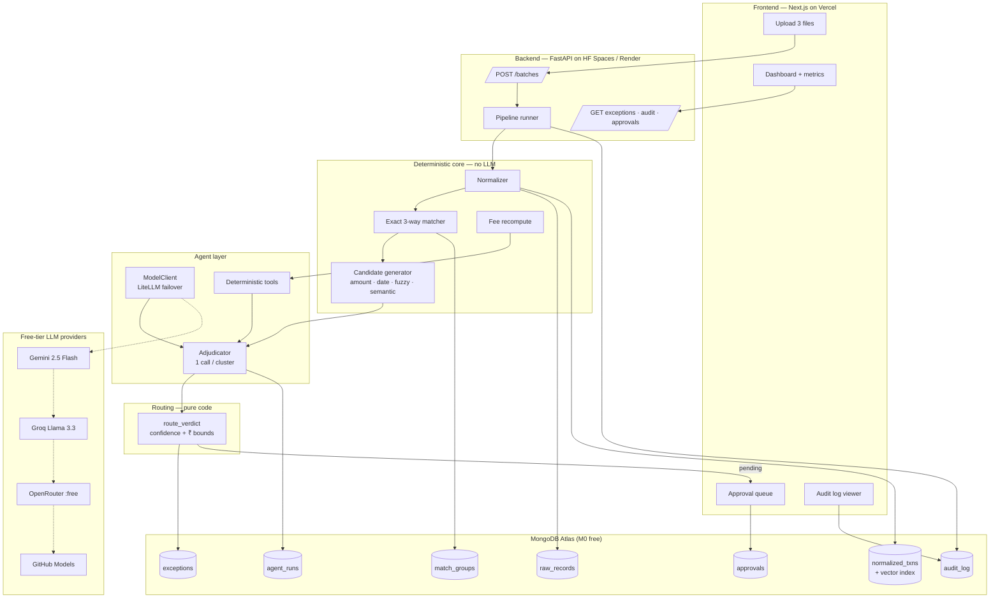
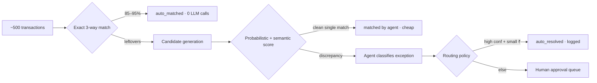
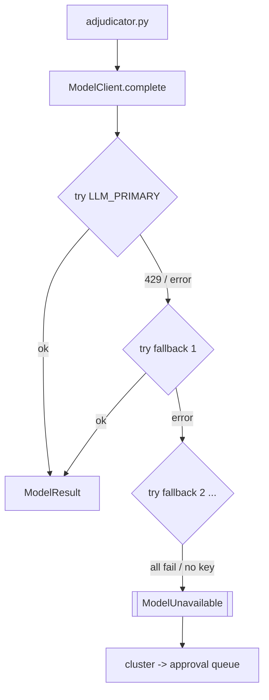

# ReconAgent — Architecture

## 1. One-paragraph summary

ReconAgent is a batch finance-ops agent. A deterministic core ingests and
three-way matches transactions across a payment-gateway settlement report, a bank
statement and an internal ledger. Only the rows it *cannot* match deterministically
are handed to an LLM, which classifies each discrepancy into a fixed taxonomy,
verifies it with deterministic tools, and returns a schema-validated verdict with
a confidence score. A pure-code routing policy then decides — within explicit
rupee and confidence bounds — whether each verdict auto-resolves or goes to a
human approval queue. Every state transition is written to an append-only audit
log.

## 2. Component diagram

## 3. The funnel (why cost stays near zero)

Only **20–60 LLM calls** per 500-transaction batch → comfortably inside every
free tier.

## 4. Data model (MongoDB collections)

| Collection | Key fields | Notes |
| --- | --- | --- |
| `batches` | `_id`, summary metrics | one run |
| `raw_records` | `batch_id`, `source`, `payload` | **immutable**, verbatim rows |
| `normalized_txns` | common schema + `narration_embedding` | vector-search index on the embedding |
| `match_groups` | `ledger_txn_id`, `pg_txn_id`, `bank_txn_id`, `method` | `method` ∈ exact \| agent \| manual |
| `exceptions` | `code`, `amount_impact`, `confidence`, `rationale`, `evidence`, `routed_to` | one per unresolved cluster |
| `resolutions` / `approvals` | reviewer, decision, note | human loop |
| `audit_log` | `actor`, `action`, `before`, `after`, `created_at` | append-only |
| `agent_runs` | `model`, `attempts`, tokens, latency, `tool_calls`, `raw_response` | full LLM traceability |

### Why MongoDB here

- `raw_records` from three sources have **three different shapes** — documents
  store them with no schema gymnastics.
- The **aggregation pipeline** expresses reporting queries ("group settlement
  lines by UTR, sum net, compare to bank credit") concisely.
- **Atlas Vector Search** does semantic narration matching in the same engine —
  no second datastore.
- Multi-document transactions cover the audit-log write path.

Trade-off accepted: three-way relationship queries use `$lookup` rather than SQL
joins. For batch sizes in the thousands this is fine.

## 5. Provider-agnostic AI (no lock-in, no local model, no cost)

- Config only: `LLM_PRIMARY`, `LLM_FALLBACKS` (comma-separated LiteLLM strings).
- No key configured ⇒ pipeline still runs; unresolved clusters route to a human.
- Swappable to a self-hosted model later by pointing at any OpenAI-compatible URL.

## 6. Deployment (all free tiers)

| Piece | Host | Free tier |
| --- | --- | --- |
| Frontend | Vercel Hobby | yes |
| Backend + agent | Hugging Face Spaces (Docker) or Render web service | yes |
| Database | MongoDB Atlas M0 | 512 MB |
| Batch queue (optional) | Upstash Redis | yes |
| CI + LLM fallback | GitHub Actions + GitHub Models | yes |

## 7. Security & correctness guardrails

1. **LLM never does arithmetic** — it cites tool outputs; Python owns every number.
2. **Money figure cross-check** — agent's `amount_impact` is re-derived from the
   tool report; a mismatch caps confidence and forces a human.
3. **Routing is code, not prompt** — confidence + rupee ceiling + code allowlist.
4. **`ALWAYS_HUMAN` codes** (missing payout, chargeback, short settlement,
   missing-in-ledger, unexplained) never auto-resolve.
5. **Immutable raw + append-only audit** — every decision is reconstructable.
6. **No secrets in code** — all keys via env; `.env` git-ignored.
