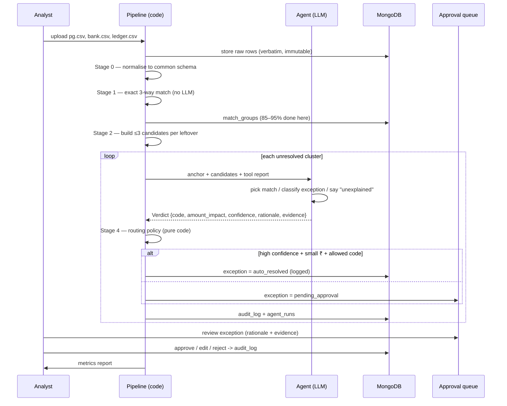

# ReconAgent — Workflow (explained simply)

## The lemonade-stand version

You run a stand. Three people hand you a notebook every day:

1. **Your notebook** (ledger): "Sold 100 cups at ₹10 = ₹1,000."
2. **Card-machine company's notebook** (PG settlement): "Collected ₹1,000, kept
   ₹20 fee + ₹3.60 tax, one kid got a ₹15 refund, sent you ₹961.40."
3. **Bank's notebook** (bank statement): "₹961.40 arrived today. Also ₹950 from
   two days ago."

Your job: make the three notebooks agree, and notice when they don't (missing
payout? overcharged fee? double entry?). ReconAgent is a robot that does this for
thousands of rows and only bothers you about the confusing ones.

## The six stages

### Stage 0 — Normalise
Every source uses different column names. The normalizer maps them all to one
shape: `{utr, amount_gross, fee, tax, amount_net, txn_date, settlement_date,
narration, ...}`. Raw rows are stored untouched first.

### Stage 1 — Exact match (no LLM)
Join on the strongest key (UTR/RRN), then check amounts tie out within ₹1 and
dates fall inside the settlement window. Ledger + PG + Bank all agree ⇒
`auto_matched`. This clears the large majority. **The LLM never sees these rows.**

### Stage 2 — Candidate generation
For each leftover row, score every possible counterpart from the other sources on
amount closeness, date closeness and fuzzy text similarity of narration/IDs. An
**exact UTR/RRN match is force-boosted to the top** so it can never be crowded
out by amount/date noise. Keep the top 6.

### Stage 3a — Deterministic signals (pure Python — this is where accuracy lives)
`compute_signals()` turns the cluster into hard, explainable facts:

- which sources are present, and whether a same-UTR counterpart with a matching
  amount exists in each (`ledger_matched`, `bank_matched`)
- `fee_overcharge_inr` / `net_short_inr` from a fee recompute
- `bank_late_days`, `sla_breached` (SLA measured against the batch's own latest
  date, not wall-clock)
- `is_duplicate`

From those it derives a **`suggested_code`** via an ordered rule list
(duplicate → missing-in-ledger → fee mismatch → short settlement →
missing-payout / timing-gap → matched → unexplained) and a
**`suggested_amount_impact`** (Python owns every rupee figure).

On the synthetic benchmark this deterministic classifier scores **100%
precision/recall on all seven outcomes**.

### Stage 3b — Agent adjudication (LLM, 1 call per cluster)
The LLM receives the anchor, its candidates, and the full `signals` object. Its
job is **not** to classify — Python already did. It:

1. **confirms** the suggested verdict/code (→ confidence ≥ 0.9, unlocks
   auto-resolution), **or**
2. **disagrees**, naming the signal it thinks is wrong (→ confidence capped,
   routes to a human), and
3. writes the plain-English `rationale` and `recommended_action`.

The LLM never changes the label or the money figure — so classification accuracy
equals the accuracy of the deterministic rules, and the agent adds explanations
plus a second pair of eyes. If no LLM is available, Stage 3b is skipped and the
deterministic verdict is used directly (routed conservatively).

### Stage 4 — Routing (pure code, not the LLM)
Auto-resolve only if **all** are true:
- verdict is an exception with a concrete code
- code is in the auto-resolve allowlist and not in `ALWAYS_HUMAN`
- `confidence ≥ 0.90` (i.e. the LLM confirmed the deterministic suggestion)
- `|amount_impact| ≤ ₹500`

Otherwise → **human approval queue**.

### Stage 5 — Human approval loop
Reviewer sees the agent's verdict, rationale and evidence; clicks approve / edit /
reject. Every action appends to `audit_log`. (Rejections become future training
examples — post-MVP.)

### Stage 6 — Reporting
Run against the synthetic `ground_truth.json` to produce hard numbers:
auto-match rate, classification precision/recall, ₹ surfaced, queue size, runtime.

## Exception taxonomy

| Code | Plain meaning | Auto-resolvable? |
| --- | --- | --- |
| `FEE_MISMATCH` | PG fee ≠ contracted MDR+GST | ✅ if small & confident |
| `TIMING_GAP` | Bank credit not in yet, still within SLA | ✅ |
| `DUPLICATE` | Same txn twice in one source | ✅ |
| `MISSING_PAYOUT` | Settled by PG, never hit bank, SLA breached | ❌ always human |
| `MISSING_IN_LEDGER` | Money in, no sale recorded | ❌ always human |
| `SHORT_SETTLEMENT` | Net < expected, unexplained | ❌ always human |
| `CHARGEBACK` | Negative adjustment = a dispute | ❌ always human |
| `REFUND` | Negative adjustment = a recorded refund | ✅ if matched |
| `FX_DIFF` | Currency conversion / rounding | review |
| `SPLIT_PAYOUT` | One bank credit = many PG lines | review |
| `UNEXPLAINED` | Agent can't account for it | ❌ always human |

## What "works without Claude / any one vendor" means here

1. Most of the pipeline is plain code — it needs no LLM at all.
2. The LLM step goes through `ModelClient`, which tries a **chain** of free
   providers (Gemini → Groq → OpenRouter free → GitHub Models) and fails over
   automatically.
3. If **no** provider is configured, the pipeline still completes — every
   unresolved cluster simply lands in the human queue instead of being
   pre-classified.
